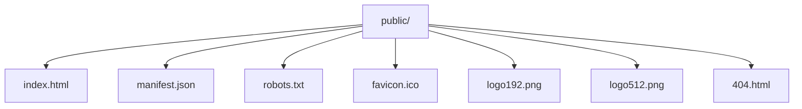

# Public Assets

Static files bundled into the production build by Create React App.

- `index.html` — HTML shell injected with the compiled React bundle.
- `manifest.json` — PWA metadata consumed by CRA.
- `robots.txt` — crawler directives.
- `404.html` — fallback page for GitHub Pages routing.
- `logo192.png` / `logo512.png` / `favicon.ico` — app icons.
