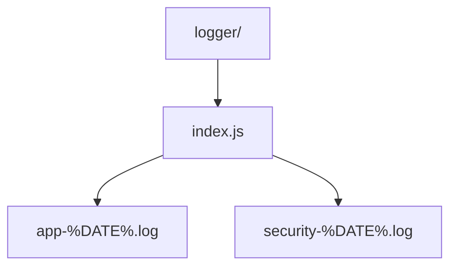

# Logger

Centralised Winston logger configuration with JSON + rotating file transports.

- `index.js` — configures logger levels, daily rotation, console formatting, and exposes the `logger` + `securityEvent` helpers.
- `logs/` — runtime output directory created automatically (gitignored).
