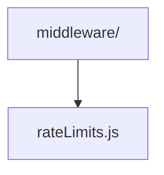

# Middleware

Express middleware utilities shared across the backend server.

```mermaid
graph TD
  MW[middleware/] --> RL[rateLimits.js]
```

- `rateLimits.js` — builds general/auth/sensitive rate limiters and centralises logging for throttled requests.
