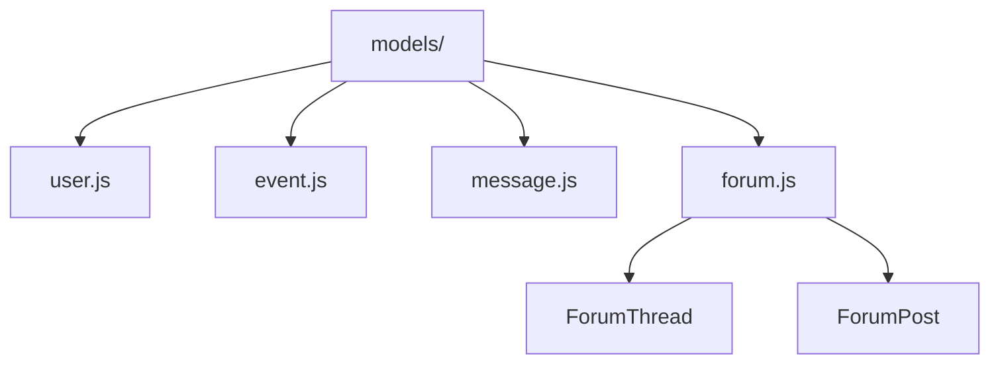

# Mongoose Models

Schema definitions backing the Express API.

- `user.js` — full profile schema (preferences, activity metadata, car collection) with partial unique email index.
- `event.js` — event listings, RSVPs, testimonials, and optional link to forum threads.
- `message.js` — messaging records between users including premium flags and read state.
- `forum.js` — thread/post schemas powering forum categories; exports `{ ForumThread, ForumPost }` models.
