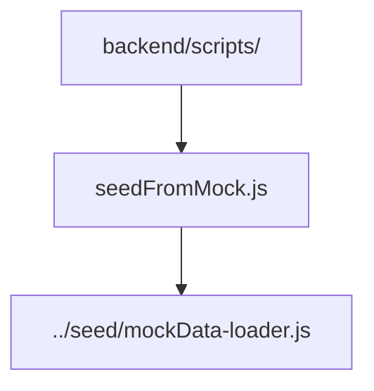

# Backend Scripts

One-off Node utilities used to maintain database state.

- `seedFromMock.js` — pulls the historical `mockApi.js` arrays from git, hashes demo passwords, and upserts users/events/messages/forums into MongoDB. Requires `MONGODB_URI` and optional `MOCK_REV`.
