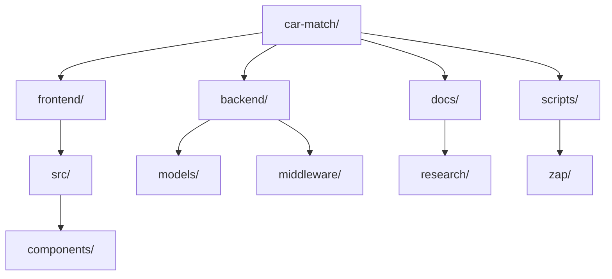

# Repository File Overview

High-level guide to every directory and notable file in the Car Match repo.
Refer to individual READMEs for deeper usage notes.

## Root
- `README.md` — project introduction, deployment overview, and contributor notes.
- `render.yaml` — Render deployment specification for backend service.
- `backend.dev.log` / `frontend.dev.log` — recent local development logs.
- `certs/` — development TLS assets generated via `scripts/setup-dev-https.sh`.
- `docs/` — course documentation, research notes, weekly logs, and guides.
- `frontend/` — React single-page application (GH Pages deployment target).
- `backend/` — Node/Express API powering auth, events, messages, forums.
- `scripts/` — automation helpers (TLS setup, roadmap sync, OWASP ZAP scans).

## Backend (`backend/`)
- `README.md` — runtime instructions, env vars, API highlights.
- `package.json` / `package-lock.json` — API dependencies and npm scripts.
- `node_modules/` — installed backend dependencies (ignored in git by default).
- `server.js` — Express application entry point, middleware wiring, routes.
- `logger/` — Winston logger config and rotating log transport setup.
- `middleware/` — auth, rate limiting, HTTPS enforcement, and error handlers.
- `models/` — Mongoose schemas for users, events, messages, and forums.
- `scripts/seedFromMock.js` — seeds MongoDB using historical mock data (see header comment).
- `seed/` — helper modules for seeding and mock data extraction.
- `.env` (gitignored) — local backend environment settings (see README for keys).

- `.eslintrc.js` — lint configuration enabling security plugin rules.
- `README.md` — CRA quick start + Car Match-specific env toggles.
- `build/` — most recent production build artefacts (generated by CI).
- `package.json` / `package-lock.json` — SPA dependencies and scripts.
- `node_modules/` — installed frontend dependencies (ignored in git by default).
- `public/` — static assets, HTML shell, manifest, robots.txt.
- `src/index.js` — React entry point.
- `src/App.js` and `src/App.css` — root application component and styles.
- `src/global.css` — project-wide CSS variables and resets.
- `src/api/` — fetch helpers (real API + mock data adapters).
- `src/context/` — React context providers (auth, profile, events, forums).
- `src/docs/` — in-app documentation or feature walkthrough data (e.g., `layout-system.md`).
- `src/components/` — UI building blocks organised by feature domain:
  - `Container/` — layout wrapper components.
  - `EntryModal/` — login/signup modal experience.
  - `Events/` — event listings, detail cards, RSVP interactions.
  - `Flex/`, `Grid/`, `Spacing/`, `Section/` — design system primitives.
  - `Forums/` — forum category lists, threads, moderation UI.
  - `Home/` — landing page hero, feature highlights, testimonials.
  - `Layout/` and `LayoutExample/` — main page shell and examples.
  - `Login/`, `SignUp/` — authentication forms and validation logic.
  - `Messages/`, `MessagesPage/` — inbox UX and message thread views.
  - `Profile/` — user profile display, ownership controls, settings link.
  - `Settings/` — user preferences and account management.
- `src/reportWebVitals.js` / `src/setupTests.js` / `src/App.test.js` — CRA defaults for metrics and testing.

## Documentation (`docs/`)
- `2025-09.md` — September weekly summary log (see instructions in `docs/log2.md`).
- `log2.md` — Week 3 log with reflection template (Log Update reminder appended).
- `research/README.md` — directory index of research deliverables.
- `research/R1-Notes.md` … `R4-Notes.md` — course-mandated security research artifacts.
- `research` supporting files — include SWOT analysis, OWASP research, tooling review.
- Additional folders capture prior milestone notes; see file headers for context.

## Scripts (`scripts/`)
- `README.md` — usage overview for automation scripts (TLS, roadmap, ZAP).
- `setup-dev-https.sh` — creates localhost TLS cert/key (frontend + backend).
- `update_roadmap.sh` — syncs GitHub Project roadmap metadata via `gh` + GraphQL.
- `zap/README.md` — OWASP ZAP usage notes and report locations.
- `zap/zap-baseline.sh` — Docker wrapper for baseline security scanning.

## Certificates (`certs/`)
- `dev/` — generated development certificate/key pair (ignored in git by default).

## Logs (`*.dev.log`)
- Temporary local logs captured during backend/frontend runs; safe to delete.

For additional component-level behaviour, open each module and refer to inline
comments plus lint rules tracked under `.eslintrc` in the respective packages.
