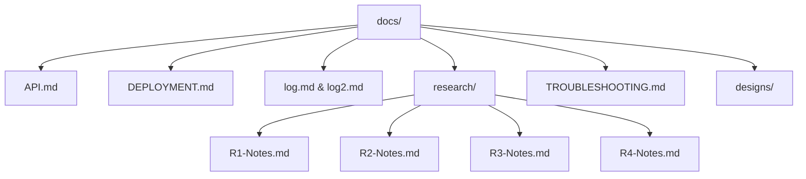

# Car Match — Documentation

Car Match is a community app for car enthusiasts — events, forums, messaging, and profiles. This repo contains a working React frontend (deployed to GitHub Pages) and a Node/Express backend (deployable on Render) with optional MongoDB persistence for forums and other data.

## Tech Stack

- Frontend: React (CRA), React Router (HashRouter for Pages), plain CSS.
- Backend: Node.js + Express 5, JWT auth, CORS hardening.
- Database: MongoDB Atlas via Mongoose (forums persist when `MONGODB_URI` is set; otherwise in-memory).
- CI/CD: GitHub Actions deploys frontend to Pages; Render blueprint for backend.

## Key Links

- Live App: https://bradleymatera.github.io/car-match/
- API/Backend: see `docs/API.md`
- Deployment: `docs/DEPLOYMENT.md` (Pages + Render)
- Troubleshooting: `docs/TROUBLESHOOTING.md`
- Research & Change Orders: `docs/research/` (see `ChangeOrders.md`)
- Logs: `docs/log.md` (original, May), `docs/log2.md` (September), and monthly snapshot `docs/2025-09.md`

## Project Ops

- Project board helper: `scripts/update_project.sh` (adds issues to Project, helps update Status fields)
- Roadmap population (dates/status): see Project updates in the repo history; items have Start/End dates based on issue activity and sprint due dates.

## Status (October 2025)

- 0.2.0 “Ownership & Moderation Rollout” is live on Render + GitHub Pages (main branch).
- Event creation, edit, delete, and RSVP now flow through Atlas with organiser checks enforced end to end (`computeNextEventId`, `syncEventCache`).
- Forums load categories/threads reliably; moderator tooling remains feature-complete while the “New Thread” submit CTA is the next UI enhancement.
- Rate limits were relaxed for beta (≈50 auth attempts / 5 min; ≈180 sensitive actions / 30 min) and documented in troubleshooting.
- Pages deploys only from `main`; Render autodeploys on push but can be redeployed manually after backend changes.

## Notes

Standard workflow uses PRs into `dev` and promotion to `main`. GitHub Pages publishes from `main` only.
