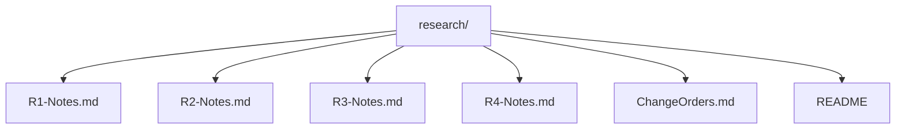

# Research

This folder contains weekly research, planning notes, and change orders for the Car Match MVP project.

Each week, I duplicate the `R#-Notes.md` template and rename it to match the current week — for example: `R1-Notes.md`, `R2-Notes.md`, etc. These notes summarize the design decisions, UI/UX flows, layout systems, mock data strategies, and infrastructure ideas currently outlined in `designdoc.md`.

As the project progresses, all future research and technical planning will be transferred from `designdoc.md` into their appropriate weekly markdown files here, starting with `R1-Notes.md`.

Change Orders
- See `docs/research/ChangeOrders.md` for Activity 1.3 Project Initiation change order tracking.

This folder is directly tied to my project’s feature branch workflow and GitHub issues/milestones structure for tracking weekly goals and development.
