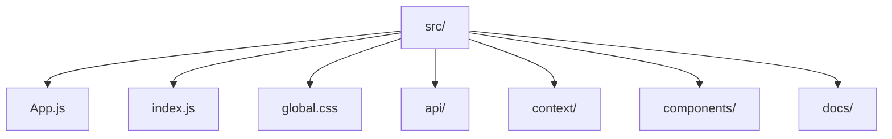

# Frontend Source

React application entry point, shared styles, and feature modules.

- `index.js` / `App.js` — bootstrap the SPA and route into feature pages.
- `App.css`, `global.css`, `index.css` — global styling and CSS variables.
- `api/` — API adapters and mock data providers.
- `context/` — React context providers (auth, profile data).
- `components/` — reusable UI building blocks and feature views.
- `docs/` — in-app documentation content consumed by components.
- `reportWebVitals.js`, `setupTests.js`, `App.test.js` — CRA defaults for performance metrics and Jest setup.
