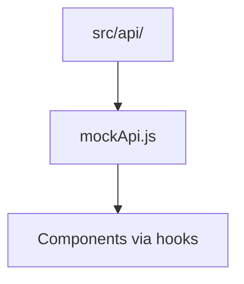

# API Layer

Helper modules that abstract backend calls and mock data.

```mermaid
graph TD
  API[src/api/] --> Mock[mockApi.js]
  Mock --> Consumers[Components via hooks]
```

- `mockApi.js` — legacy mock data provider kept for seeding/backups; live builds use REST calls to the deployed backend.
