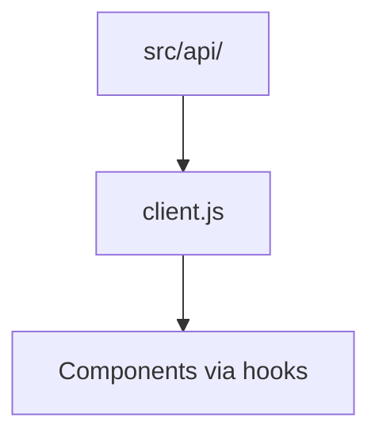

# API Layer

Helper modules that wrap the live backend REST API.

```mermaid
graph TD
  API[src/api/] --> Client[client.js]
  Client --> Consumers[Components via hooks]
```

- `client.js` — fetch helpers for auth, events, forums, messages, and profile endpoints against the Express API.
