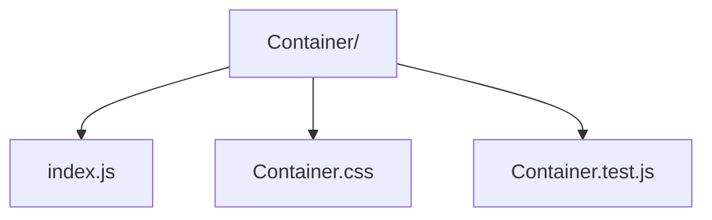

# Container Component

Responsive wrapper component providing max-width and fluid layout options.

- `index.js` — renders the `Container` component with `size`/`fluid` props.
- `Container.css` — width breakpoints and padding rules.
- `Container.test.js` — smoke tests for default rendering.
