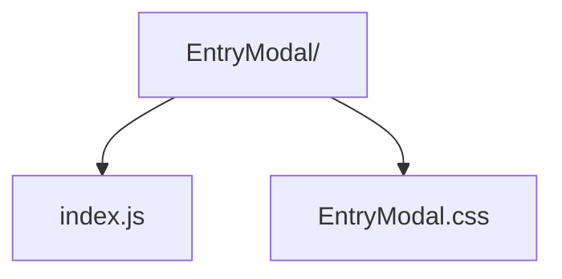

# Entry Modal

First-run onboarding modal guiding users through initial profile capture.

- `index.js` — stateful component collecting car preference, demographics, and credentials before handing off to the caller.
- `EntryModal.css` — modal layout and form styling.
