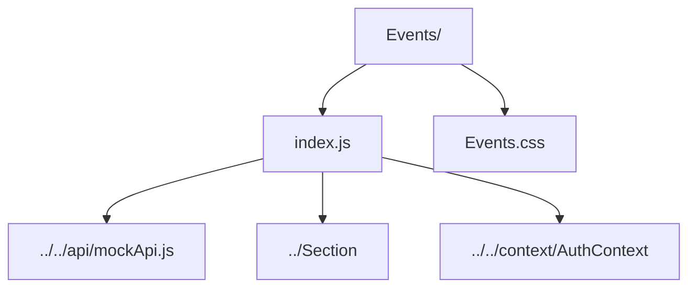

# Events Feature

Events landing page with carousel, calendar, RSVP handling, and forum previews.

- `index.js` — orchestrates event fetching, RSVP mutations, event creation modal logic, and background rotation.
- `Events.css` — presentation for the events page, hero, cards, and modal.
