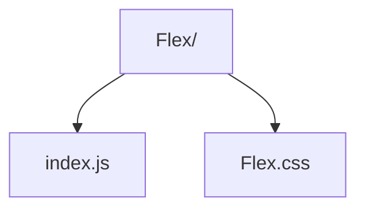

# Flex Utility

Composable flexbox wrapper with shorthand props for direction, wrapping, alignment, and gaps.

- `index.js` — renders a `
` with BEM-ish flex classes derived from props.
- `Flex.css` — defines the flexbox utility classes (direction, gap, alignment).
