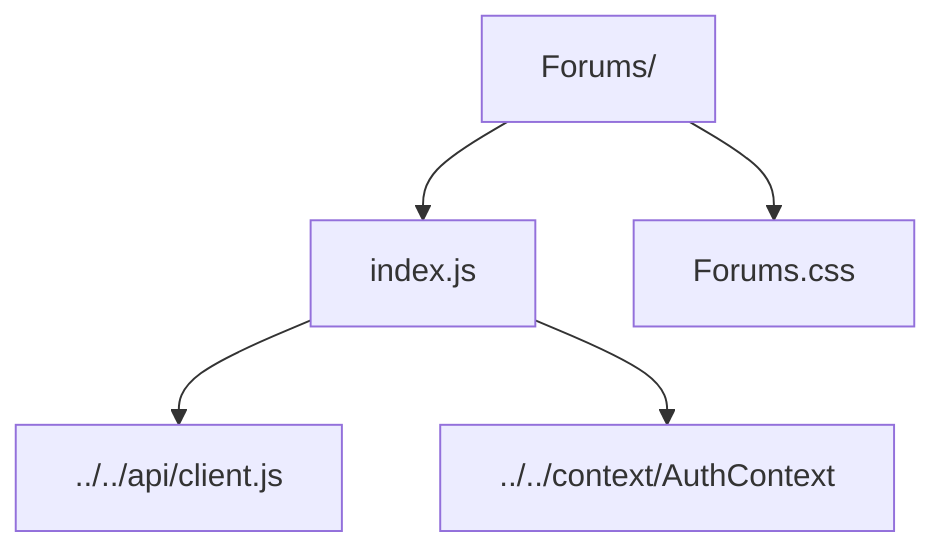

# Forums Feature

Forums hub for categories, threads, moderation, and post workflows.

- `index.js` — loads categories/threads, handles search + pagination, moderation actions, and thread/post composition.
- `Forums.css` — styling for forum list, thread detail, and responsive layout.
