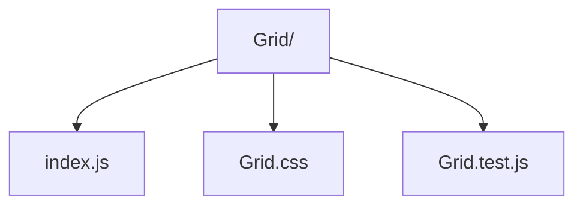

# Grid Utility

CSS grid helper with props for responsive column counts and spacing.

- `index.js` — outputs classnames for base + responsive column counts.
- `Grid.css` — defines the CSS grid utility classes.
- `Grid.test.js` — unit tests ensuring class composition behaves as expected.
