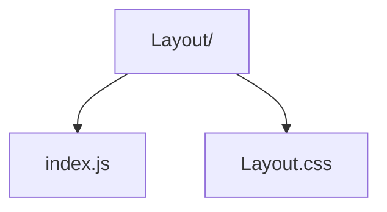

# Layout Shell

Top-level page wrapper that constrains content width and applies consistent background spacing.

- `index.js` — wraps children with layout scaffolding.
- `Layout.css` — background gradients and container spacing.
