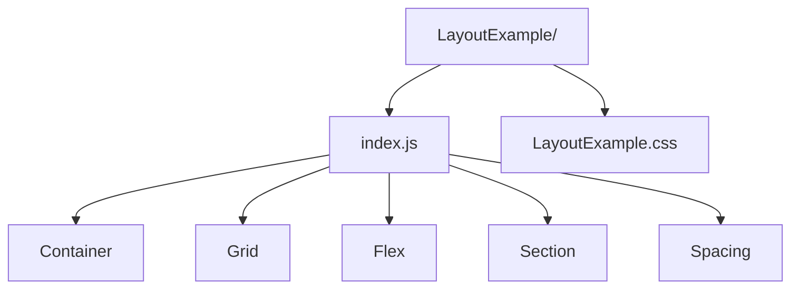

# Layout Example

Showcase page demonstrating Container, Grid, Flex, Section, and Spacing utilities together with a carousel demo.

- `index.js` — renders live usage examples for layout primitives and responsive patterns.
- `LayoutExample.css` — visual styling for the demo panels and carousel.
