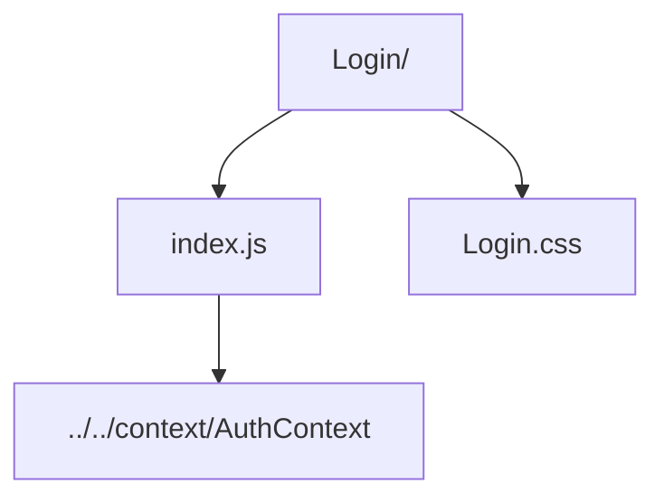

# Login Form

Authentication form that validates credentials before invoking `AuthContext.login`.

- `index.js` — handles input validation, ties into context login, and redirects after success.
- `Login.css` — layout and animated background for the login screen.
