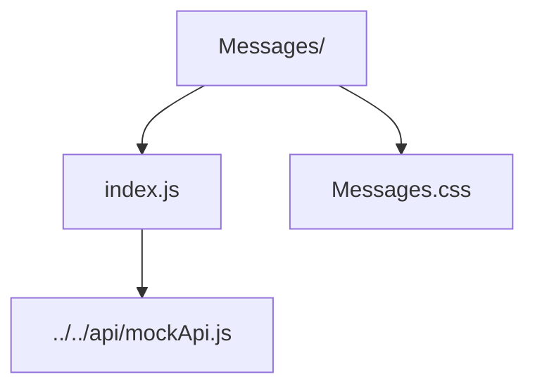

# Messages Widget

Legacy messaging UI (not wired into routing) used for concept demos.

- `index.js` — placeholder component showing conversation display and composer wiring.
- `Messages.css` — message bubble layout and form styling.
