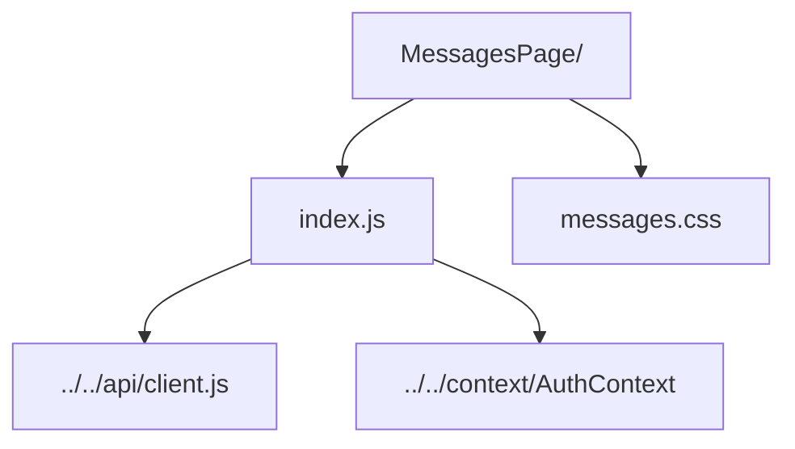

# Messages Page

Full messaging dashboard with tabbed inbox views, premium filters, and composer.

- `index.js` — manages tab state, premium-only filters, message fetching, and send workflow.
- `messages.css` — inbox layout, tabs, filters, and compose form styling.
