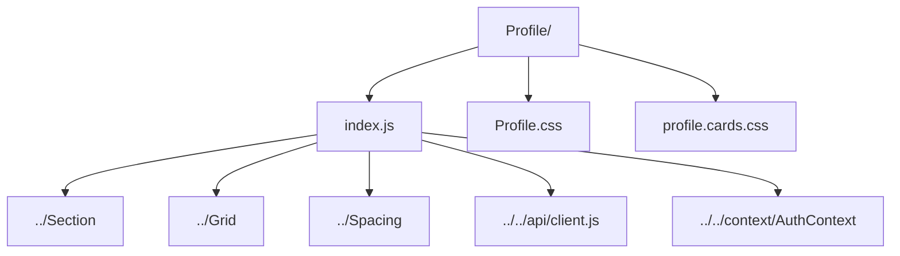

# Profile Hub

Profile dashboard combining user bio editing, garage showcase, event ownership, and messaging shortcuts.

- `index.js` — complex view handling profile edits, preference toggles, premium gating, and personal event/message data.
- `Profile.css` — primary styling for profile layout and modular cards.
- `profile.cards.css` — supplemental card-specific styling.
