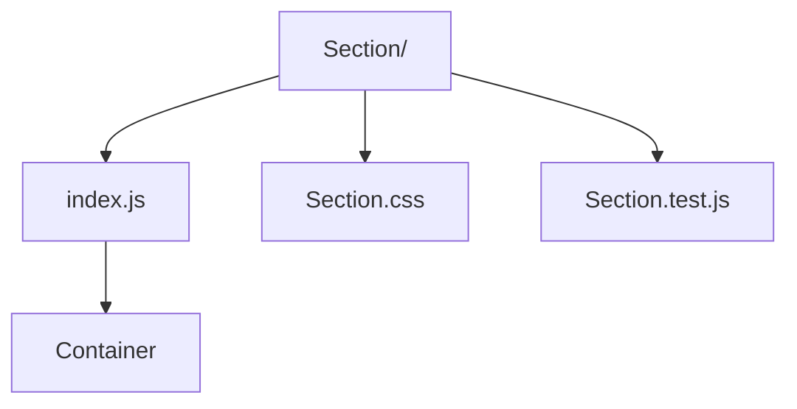

# Section Wrapper

Semantic `<section>` wrapper with optional background themes and spacing presets.

- `index.js` — renders a section with configurable spacing/background and optional `Container` wrapper.
- `Section.css` — handles spacing tokens and background modifiers.
- `Section.test.js` — ensures class composition logic works as intended.
