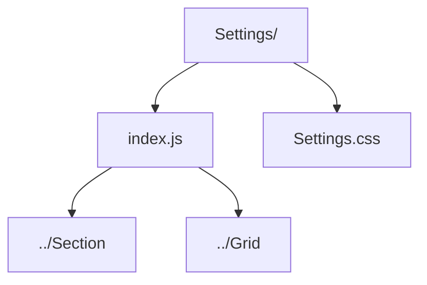

# Settings Page

Static profile/settings dashboard presenting account, notification, and security actions.

- `index.js` — renders the settings overview cards and action buttons.
- `Settings.css` — card layout, iconography, and danger zone styling.
