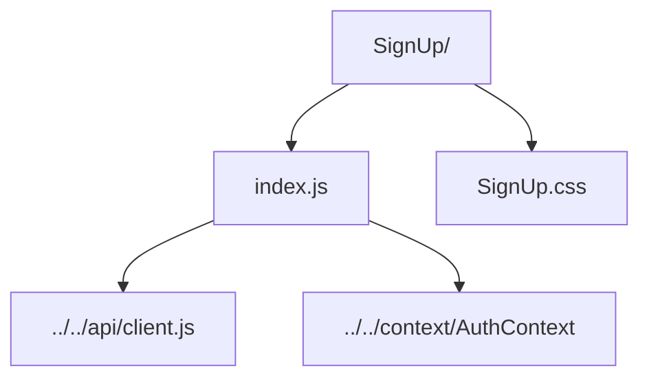

# Sign Up Form

User registration screen with client-side validation before calling the backend.

- `index.js` — gathers profile inputs, enforces validation (email, password strength, tag format, state), and posts to `registerUser`.
- `SignUp.css` — theming and background for the form.
