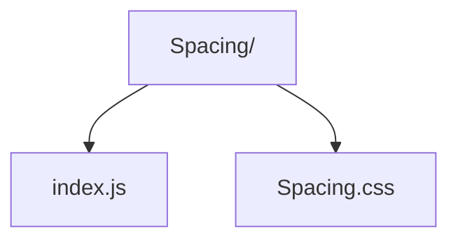

# Spacing Utility

Applies margin/padding utility classes around children based on shorthand props.

- `index.js` — maps `m`, `p`, `mt`, etc. props into CSS utility classes.
- `Spacing.css` — defines the actual spacing scale tokens.
