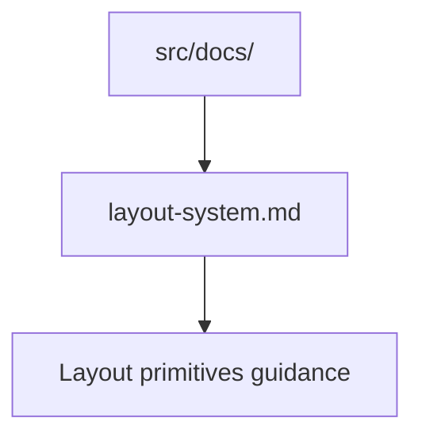

# In-App Docs

Markdown snippets rendered inside the application for UI walkthroughs.

```mermaid
graph TD
  Docs[src/docs/] --> Layout[layout-system.md]
  Layout --> Components[Layout primitives guidance]
```

- `layout-system.md` — explains the layout grid, spacing, and design tokens referenced by UI components.
