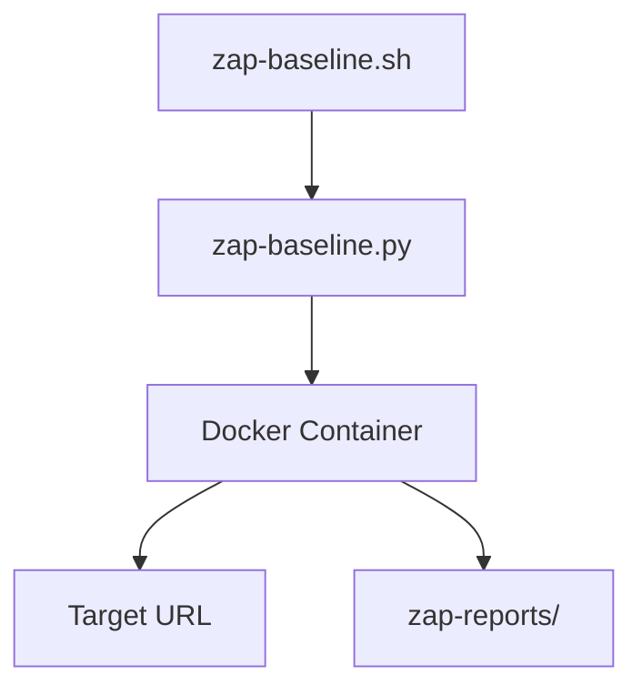

# OWASP ZAP Utilities

Security scanning helpers that run [OWASP ZAP](https://www.zaproxy.org/) from
Docker to validate Car Match against common web vulnerabilities.



## zap-baseline.sh
Runs the ZAP baseline scan (`zap-baseline.py`) against a target URL defined on
the command line. The script streams scan output, stores HTML/JSON/XML reports
under `zap-reports/`, and exposes a few environment variables for advanced use:

- `ZAP_IMAGE`: alternate Docker image tag (default `owasp/zap2docker-stable`).
- `ZAP_CONTEXT_FILE`: optional `.context` file to mount into the container.
- `ZAP_CONFIG_ARGS`: extra arguments forwarded to `zap-baseline.py`.

Example:

```bash
./scripts/zap/zap-baseline.sh https://car-match-h2gw.onrender.com
```

Reports are written to `zap-reports/zap-baseline-<timestamp>.*` for later review
and attachment to compliance documentation.
